# 📚 Documentación del Sistema CI/CD Automático

Este documento describe el sistema de integración y despliegue continuo (CI/CD) configurado para el portfolio de Alejandro de la Fuente.

## 🎯 Resumen Ejecutivo

El sistema automatiza completamente el proceso desde el desarrollo hasta la producción, garantizando calidad y desplegando automáticamente cambios validados en tellmealex.com.

## 🏗️ Arquitectura General

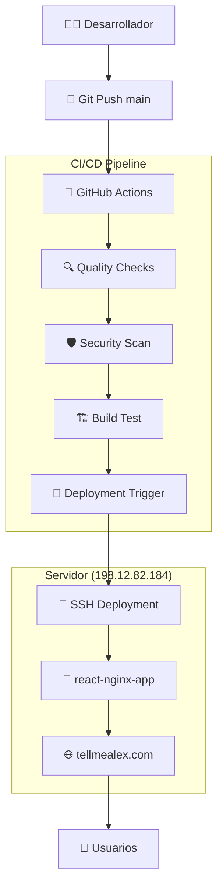

## 📋 Flujo Detallado del Proceso

### 1. Desarrollo y Commit

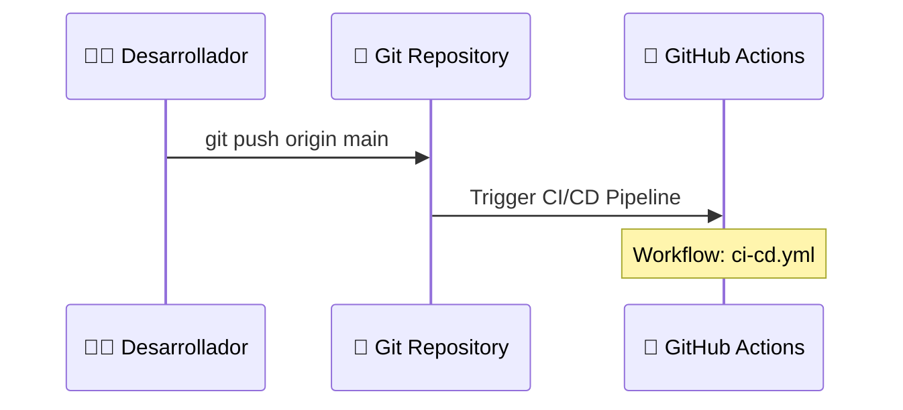

### 2. Pipeline de Calidad (CI/CD)

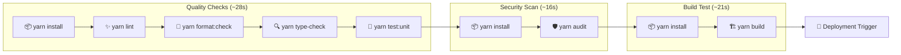

### 3. Despliegue SSH Automático

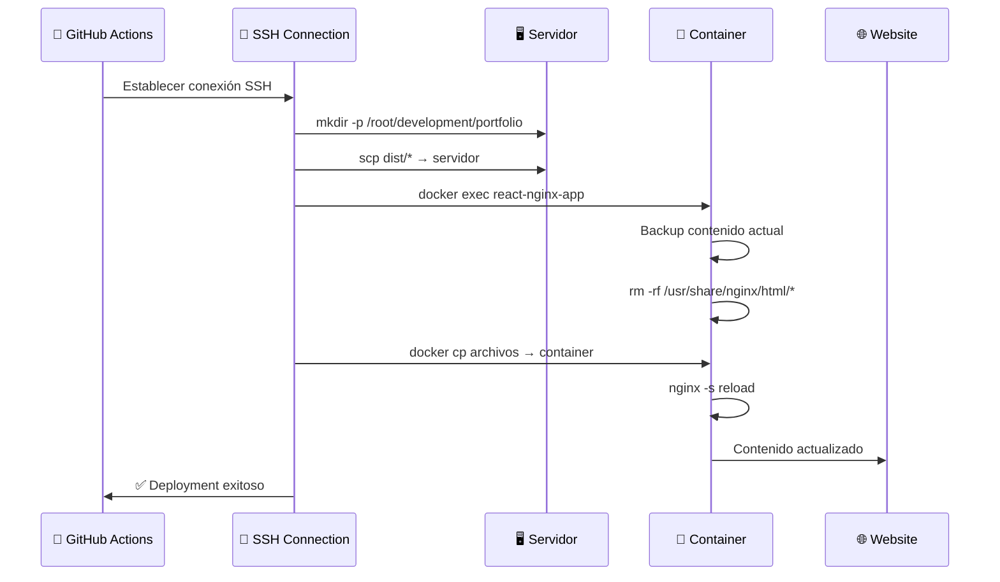

## 🔧 Componentes Técnicos

### Archivos de Configuración

#### `.github/workflows/ci-cd.yml`
- **Propósito**: Pipeline principal de validación
- **Triggers**: Push/PR a rama `main`
- **Jobs**: quality-checks → security-scan → build-test → deployment-trigger

#### `.github/workflows/deploy-ssh.yml`
- **Propósito**: Despliegue automático al servidor
- **Trigger**: Completion exitosa de ci-cd.yml
- **Estrategia**: Actualización in-place del container existente

### Stack Tecnológico

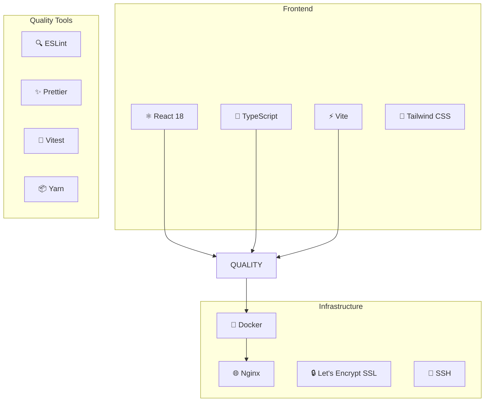

## 🚀 Proceso de Despliegue Detallado

### Estrategia de Container Update

El sistema utiliza una estrategia inteligente que **actualiza el container existente** en lugar de crear uno nuevo:

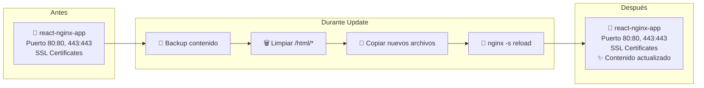

### Ventajas de esta Estrategia

1. **Zero Downtime**: El container nunca se detiene
2. **SSL Preservation**: Mantiene certificados Let's Encrypt
3. **Port Management**: Evita conflictos de puerto 80/443
4. **Rollback Safety**: Backup automático antes de actualizar

## 📊 Métricas y Tiempos

### Tiempos Promedio de Ejecución

```mermaid
gantt
    title Timeline del CI/CD Process
    dateFormat X
    axisFormat %s

    section CI Pipeline
    Quality Checks    :0, 28
    Security Scan     :28, 44
    Build Test        :44, 65
    Trigger           :65, 68

    section SSH Deploy
    Setup SSH         :68, 73
    Deploy to Server  :73, 108
    Verify            :108, 113

    section Total
    Complete Process  :0, 113
```

**Tiempo Total**: ~2 minutos desde push hasta deployment

## 🔒 Configuración de Seguridad

### GitHub Secrets Requeridos

```yaml
SSH_HOST: "198.12.82.184"           # IP del servidor
SSH_USER: "root"                     # Usuario SSH
SSH_PRIVATE_KEY: "-----BEGIN..."     # Clave privada SSH
```

### Validaciones de Seguridad

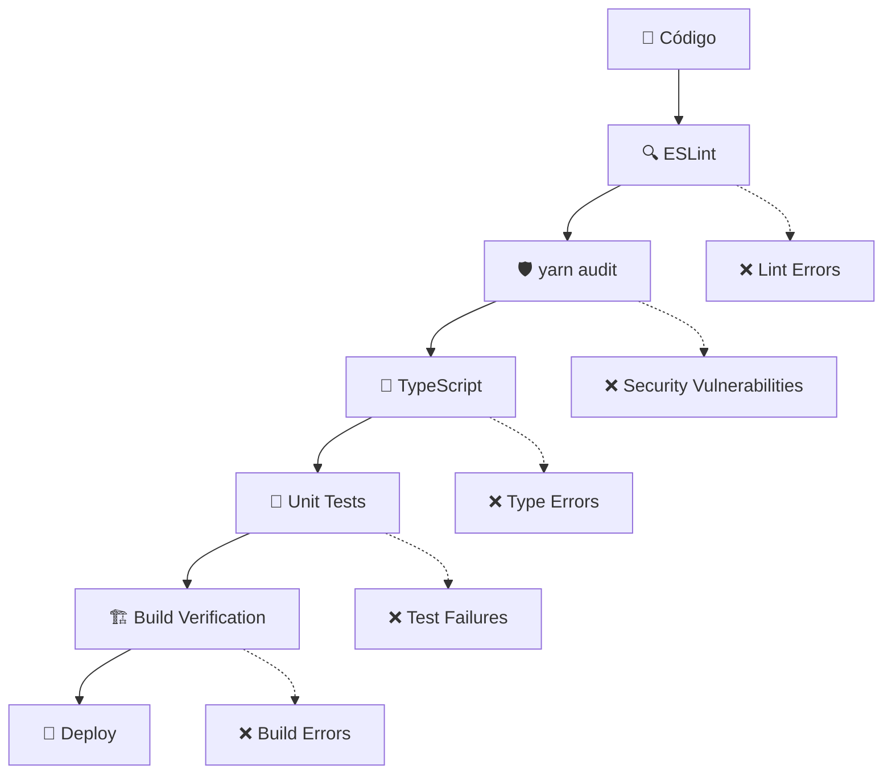

## 📁 Estructura de Archivos

### En el Repositorio
```
portfolio/
├── .github/workflows/
│   ├── ci-cd.yml              # Pipeline principal
│   └── deploy-ssh.yml         # Despliegue SSH
├── src/                       # Código fuente React
├── public/                    # Assets estáticos
├── docs/                      # Documentación
├── package.json               # Dependencias y scripts
├── yarn.lock                  # Lock de dependencias
├── vite.config.ts            # Configuración Vite
└── tailwind.config.js        # Configuración Tailwind
```

### En el Servidor (Container)
```
/usr/share/nginx/html/
├── index.html                 # Aplicación principal
├── assets/
│   ├── index-[hash].js       # JavaScript bundle
│   ├── index-[hash].css      # CSS bundle
│   └── vendor-[hash].js      # Vendor bundle
└── vite.svg                  # Assets estáticos
```

## 🔄 Flujo de Rollback

En caso de problemas, el sistema mantiene backups automáticos:

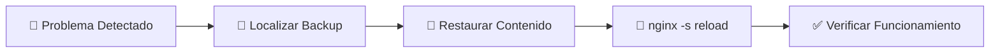

### Comando de Rollback Manual
```bash
# Conectar al servidor
ssh root@198.12.82.184

# Listar backups disponibles
ls -la /tmp/backup-*

# Restaurar backup específico
docker exec react-nginx-app cp -r /tmp/backup-YYYYMMDD-HHMMSS/* /usr/share/nginx/html/

# Recargar nginx
docker exec react-nginx-app nginx -s reload
```

## 🎛️ Monitoreo y Debugging

### Comandos Útiles de Verificación

```bash
# Estado del workflow
gh run list -R TellMeAlex/portfolio --limit 5

# Logs de deployment fallido
gh run view [RUN_ID] --log-failed

# Estado del container en servidor
ssh root@198.12.82.184 "docker ps | grep react-nginx-app"

# Logs del container
ssh root@198.12.82.184 "docker logs react-nginx-app --tail 20"

# Verificar contenido actual
ssh root@198.12.82.184 "docker exec react-nginx-app ls -la /usr/share/nginx/html/"
```

### Health Checks

El sistema incluye verificaciones automáticas:

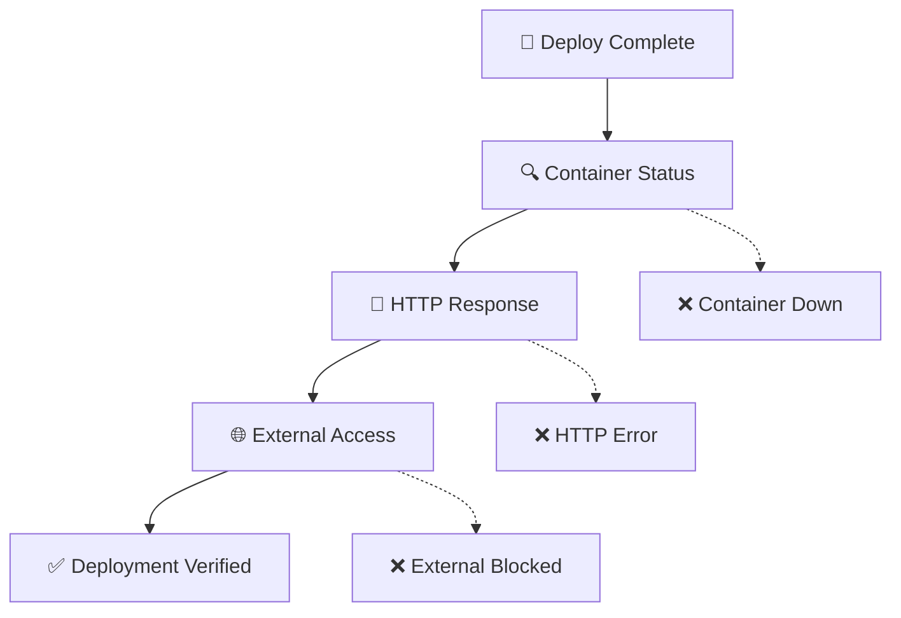

## 📈 Beneficios del Sistema

### Para el Desarrollo
- ✅ **Automatización Completa**: Cero intervención manual
- ✅ **Calidad Garantizada**: Múltiples gates de validación
- ✅ **Feedback Inmediato**: Errores detectados en minutos
- ✅ **Deployment Seguro**: Backup automático y rollback

### Para la Producción
- ✅ **Zero Downtime**: Actualizaciones sin interrupciones
- ✅ **SSL Preservation**: Certificados mantenidos automáticamente
- ✅ **Performance**: Assets optimizados con Vite
- ✅ **Monitoring**: Logs y métricas integradas

### Para el Mantenimiento
- ✅ **Reproducibilidad**: Mismo proceso cada vez
- ✅ **Trazabilidad**: Logs completos de cada deployment
- ✅ **Escalabilidad**: Fácil extensión para nuevos ambientes
- ✅ **Documentación**: Proceso completamente documentado

## 🚦 Estados del Sistema

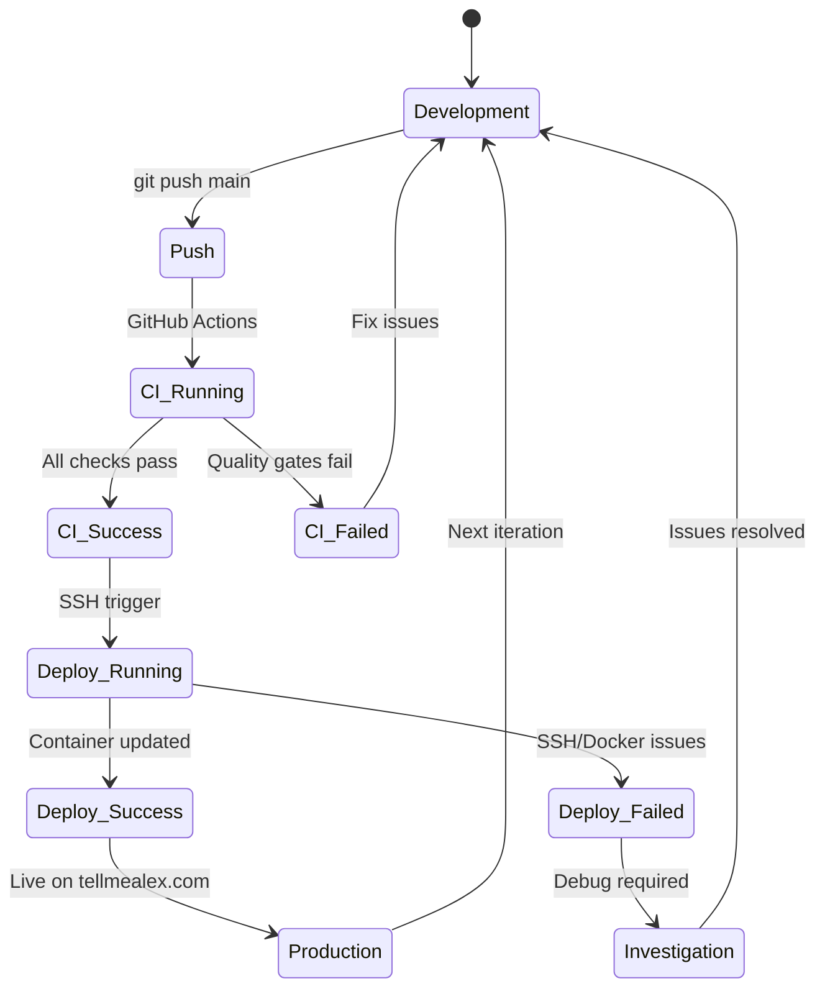

## 🎯 Próximos Pasos Sugeridos

### Mejoras Potenciales
1. **Monitoring Avanzado**: Integración con Datadog/New Relic
2. **Testing E2E**: Playwright tests automáticos
3. **Multiple Environments**: Staging environment
4. **Performance Metrics**: Core Web Vitals tracking
5. **Notifications**: Slack/Discord integration

### Escalabilidad
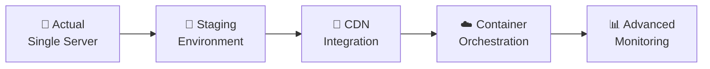

---

**🎉 Sistema CI/CD Completamente Funcional**
**📅 Implementado**: Octubre 2025
**🔗 URL**: https://tellmealex.com
**📧 Contacto**: llamamealex@gmail.com