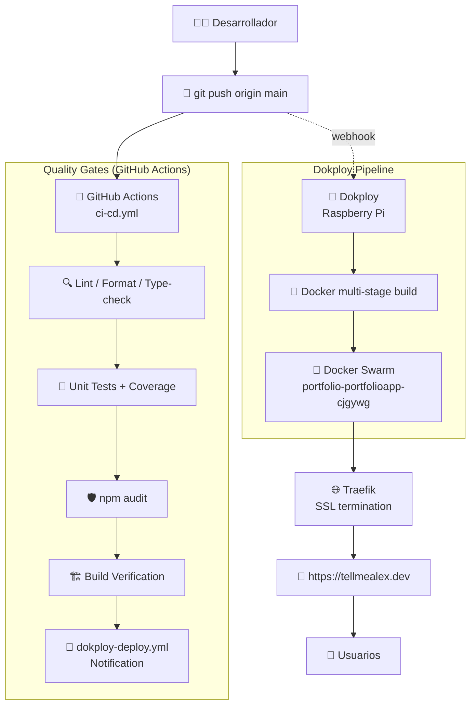
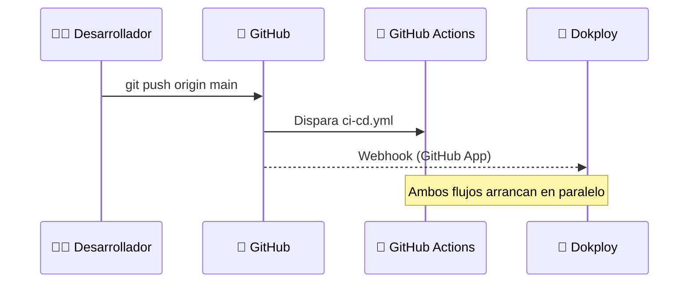
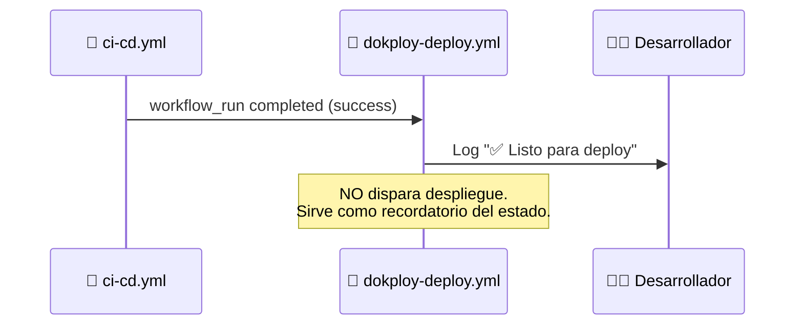
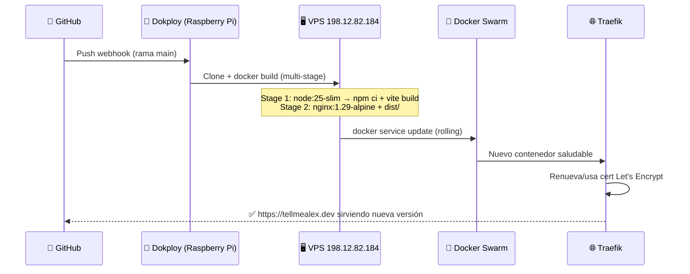
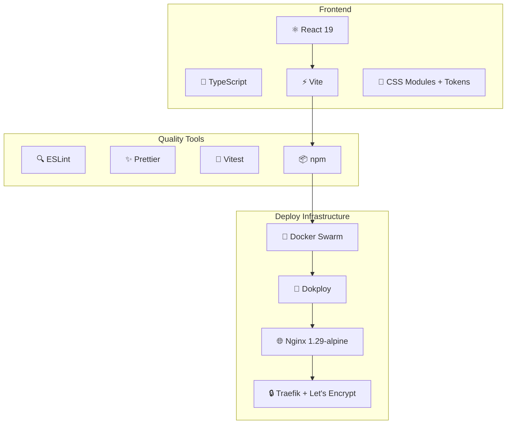
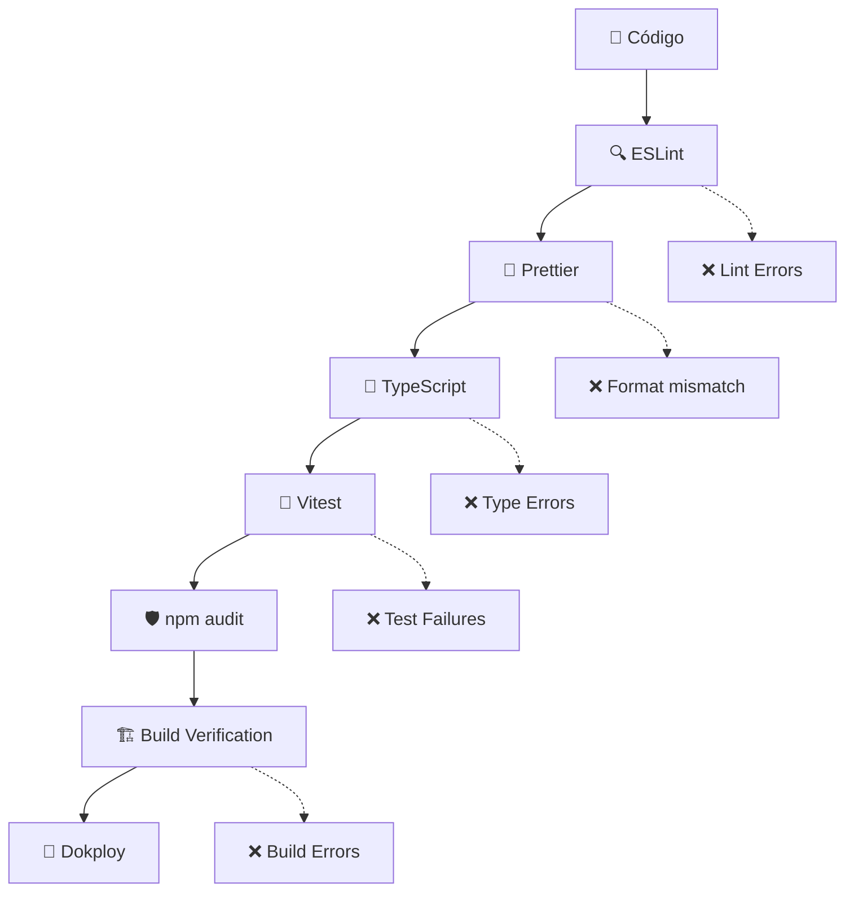
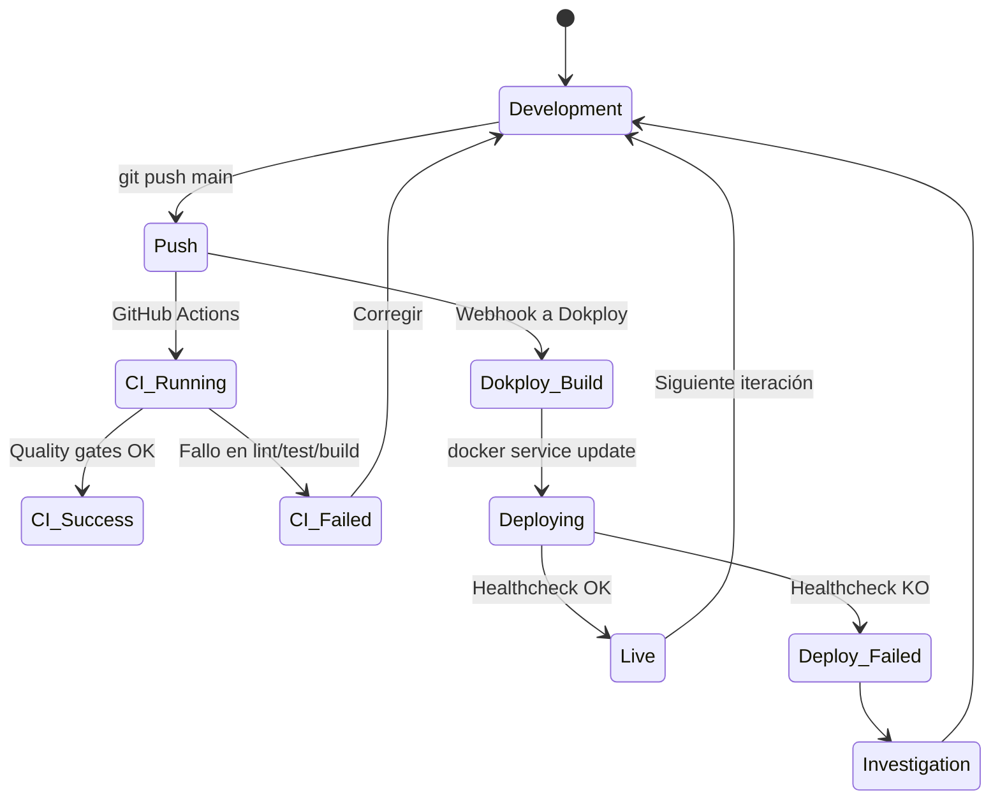

# 📚 Documentación del Sistema CI/CD

Este documento describe el pipeline real de integración y despliegue continuo del portfolio de Alejandro de la Fuente.

## 🎯 Resumen Ejecutivo

El sistema separa validación (GitHub Actions) y despliegue (Dokploy). GitHub Actions ejecuta los quality gates y notifica el estado; Dokploy escucha el webhook de GitHub y orquesta el build + despliegue del contenedor Docker en el VPS de producción. Traefik (incluido en Dokploy) termina TLS y enruta el tráfico hacia el contenedor.

## 🏗️ Arquitectura General


```mermaid
graph TB
    DEV[👨‍💻 Desarrollador] --> GIT[📁 git push origin main]
    GIT --> GHA[🤖 GitHub Actions<br/>ci-cd.yml]

    subgraph "Quality Gates (GitHub Actions)"
        GHA --> QC[🔍 Lint / Format / Type-check]
        QC --> TST[🧪 Unit Tests + Coverage]
        TST --> SC[🛡️ npm audit]
        SC --> BT[🏗️ Build Verification]
        BT --> NOTIF[📣 dokploy-deploy.yml<br/>Notification]
    end

    GIT -. webhook .-> DOK[🚢 Dokploy<br/>Raspberry Pi]

    subgraph "Dokploy Pipeline"
        DOK --> BUILD[🐳 Docker multi-stage build]
        BUILD --> SWARM[🐝 Docker Swarm<br/>portfolio-portfolioapp-cjgywg]
    end

    SWARM --> TRAEFIK[🌐 Traefik<br/>SSL termination]
    TRAEFIK --> WEB[🔗 https://tellmealex.dev]
    WEB --> USER[👥 Usuarios]
```

> **Nota**: GitHub Actions y Dokploy operan en paralelo a partir del mismo evento `push`. El deploy _no_ depende del éxito de los quality gates — si los tests fallan, lo que llega a producción puede seguir construyéndose. Si quieres bloquear deploys ante fallos de CI, configura una branch protection rule que exija `ci-cd.yml` como check antes de poder mergear a `main`.

## 📋 Flujo Detallado

### 1. Push a `main`


```mermaid
sequenceDiagram
    participant Dev as 👨‍💻 Desarrollador
    participant Git as 📁 GitHub
    participant GHA as 🤖 GitHub Actions
    participant DOK as 🚢 Dokploy

    Dev->>Git: git push origin main
    Git->>GHA: Dispara ci-cd.yml
    Git-->>DOK: Webhook (GitHub App)
    Note over GHA,DOK: Ambos flujos arrancan en paralelo
```

### 2. Pipeline de Validación (`ci-cd.yml`)


```mermaid
graph LR
    subgraph "Job: quality-checks"
        QC1[📦 npm ci]
        QC2[✨ npm run lint]
        QC3[🎨 npm run format:check]
        QC4[🔍 npm run type-check]
        QC5[🧪 npm run test:unit --coverage]
        QC6[📊 Upload Codecov]
        QC1 --> QC2 --> QC3 --> QC4 --> QC5 --> QC6
    end

    subgraph "Job: security-scan"
        SC1[📦 npm ci]
        SC2[🛡️ npm audit --audit-level moderate]
        SC1 --> SC2
    end

    subgraph "Job: build-test"
        BT1[📦 npm ci]
        BT2[🏗️ npm run build]
        BT1 --> BT2
    end

    subgraph "Job: deployment-notification"
        DN1[✅ Reporta estado]
    end

    QC6 --> SC1
    SC2 --> BT1
    BT2 --> DN1
```

**Workflow file**: [.github/workflows/ci-cd.yml](../.github/workflows/ci-cd.yml)

Jobs en orden:

1. `quality-checks` — instala con `npm ci`, ejecuta lint, format check, type-check, tests con cobertura, sube coverage a Codecov.
2. `security-scan` — `npm audit --audit-level moderate` (continue-on-error: true; informa pero no bloquea).
3. `build-test` — verifica que `npm run build` termina sin errores.
4. `deployment-notification` — solo si el push es a `main`: imprime un resumen indicando que Dokploy se encargará del deploy.

### 3. Notificación de Deploy (`dokploy-deploy.yml`)


```mermaid
sequenceDiagram
    participant GHA as 🤖 ci-cd.yml
    participant DN as 📣 dokploy-deploy.yml
    participant Dev as 👨‍💻 Desarrollador

    GHA->>DN: workflow_run completed (success)
    DN->>Dev: Log "✅ Listo para deploy"
    Note over DN: NO dispara despliegue.<br/>Sirve como recordatorio del estado.
```

**Workflow file**: [.github/workflows/dokploy-deploy.yml](../.github/workflows/dokploy-deploy.yml)

Este workflow escucha el evento `workflow_run` del CI principal y simplemente registra que el código está listo. El deploy real ocurre vía webhook directo de GitHub → Dokploy, independiente de GitHub Actions.

### 4. Build y Deploy en Dokploy


```mermaid
sequenceDiagram
    participant Git as 📁 GitHub
    participant DOK as 🚢 Dokploy (Raspberry Pi)
    participant VPS as 🖥️ VPS 198.12.82.184
    participant SWARM as 🐝 Docker Swarm
    participant TRAEFIK as 🌐 Traefik

    Git->>DOK: Push webhook (rama main)
    DOK->>VPS: Clone + docker build (multi-stage)
    Note over VPS: Stage 1: node:25-slim → npm ci + vite build<br/>Stage 2: nginx:1.29-alpine + dist/
    VPS->>SWARM: docker service update (rolling)
    SWARM->>TRAEFIK: Nuevo contenedor saludable
    TRAEFIK->>TRAEFIK: Renueva/usa cert Let's Encrypt
    TRAEFIK-->>Git: ✅ https://tellmealex.dev sirviendo nueva versión
```

## 🔧 Componentes Técnicos

### Workflows de GitHub Actions

| Archivo                                                                         | Trigger                                                       | Propósito                                                    |
| ------------------------------------------------------------------------------- | ------------------------------------------------------------- | ------------------------------------------------------------ |
| [.github/workflows/ci-cd.yml](../.github/workflows/ci-cd.yml)                   | `push` y `pull_request` a `main` (`push` también a `develop`) | Quality gates: lint, format, type-check, tests, audit, build |
| [.github/workflows/dokploy-deploy.yml](../.github/workflows/dokploy-deploy.yml) | `workflow_run` de "CI/CD Pipeline" (success, rama main)       | Notificación informativa de que el deploy está listo         |
| [.github/workflows/security.yml](../.github/workflows/security.yml)             | Programado / PR                                               | Escaneo de seguridad adicional                               |
| [.github/workflows/performance.yml](../.github/workflows/performance.yml)       | PR / programado                                               | Métricas de rendimiento (Lighthouse)                         |
| [.github/workflows/pr-validation.yml](../.github/workflows/pr-validation.yml)   | PR                                                            | Validaciones específicas de pull requests                    |

### Dockerfile (multi-stage)

Ver [Dockerfile](../Dockerfile) para el detalle completo. Resumen:

- **Stage 1 — builder** (`node:25-slim`): instala dependencias del sistema, `npm ci`, type-check, lint (best-effort), `npm run build` con `NODE_ENV=production`.
- **Stage 2 — runtime** (`nginx:1.29-alpine`): copia `dist/` del builder a `/usr/share/nginx/html`, monta `nginx.conf` propio, ejecuta como usuario `nginx`, expone puerto `80`, healthcheck cada 30 s.

Imagen final ~50 MB. El TLS lo termina Traefik, no Nginx.

### Stack Tecnológico


```mermaid
graph TB
    subgraph "Frontend"
        REACT[⚛️ React 19]
        TS[📘 TypeScript]
        VITE[⚡ Vite]
        CSS[🎨 CSS Modules + Tokens]
    end

    subgraph "Quality Tools"
        ESLINT[🔍 ESLint]
        PRETTIER[✨ Prettier]
        VITEST[🧪 Vitest]
        NPM[📦 npm]
    end

    subgraph "Deploy Infrastructure"
        DOK[🚢 Dokploy]
        DOCKER[🐳 Docker Swarm]
        NGINX[🌐 Nginx 1.29-alpine]
        TRAEFIK[🔒 Traefik + Let's Encrypt]
    end

    REACT --> VITE
    VITE --> NPM
    NPM --> DOCKER
    DOCKER --> DOK
    DOK --> NGINX
    NGINX --> TRAEFIK
```

## 🚀 Estrategia de Despliegue

Dokploy ejecuta `docker service update` sobre la stack Swarm. La rolling update levanta el nuevo contenedor, espera al healthcheck `HEALTHCHECK CMD curl -f http://localhost/`, y solo entonces drena el anterior. Resultado: zero downtime y rollback trivial desde la UI de Dokploy si el deploy queda en estado unhealthy.

### Ventajas de delegar en Dokploy + Traefik

1. **Zero downtime** vía rolling update de Docker Swarm.
2. **SSL automático**: Traefik renueva certificados Let's Encrypt sin intervención.
3. **Rollback con un click** desde la UI de Dokploy a cualquier deploy anterior.
4. **Sin secrets SSH en GitHub**: el deploy lo orquesta Dokploy hablando con su propio Docker daemon.
5. **Build aislado**: ocurre dentro del contenedor de Dokploy, no en el runner de GitHub Actions.

## 📊 Tiempos Aproximados


```mermaid
gantt
    title Timeline desde push hasta producción
    dateFormat X
    axisFormat %ss

    section GitHub Actions
    quality-checks            :0, 60
    security-scan             :60, 75
    build-test                :75, 100
    deployment-notification   :100, 105

    section Dokploy (paralelo)
    docker build              :0, 120
    docker service update     :120, 165
    healthcheck + traffic switch :165, 180

    section Resultado
    Live en tellmealex.dev    :180, 185
```

**Tiempo total típico**: ~3 minutos desde push hasta nueva versión sirviendo tráfico.

## 🔒 Seguridad

### Secrets de GitHub

```yaml
DOKPLOY_API_TOKEN: <token> # Solo necesario si quieres disparar deploys desde GitHub Actions
```

Actualmente el deploy lo dispara la GitHub App de Dokploy (`Dokploy-2025-10-23-b1h5vv`), por lo que no es estrictamente necesario almacenar secrets de SSH ni de servidor en GitHub. Los secrets antiguos (`SSH_HOST`, `SSH_USER`, `SSH_PRIVATE_KEY`, `RASPBERRY_PI_*`, `TAILSCALE_*`) se pueden eliminar — ver [DOKPLOY-AUTO-DEPLOY-SETUP.md](../DOKPLOY-AUTO-DEPLOY-SETUP.md).

### Validaciones encadenadas


```mermaid
graph TD
    CODE[📝 Código] --> LINT[🔍 ESLint]
    LINT --> FMT[🎨 Prettier]
    FMT --> TYPE[📘 TypeScript]
    TYPE --> TEST[🧪 Vitest]
    TEST --> AUDIT[🛡️ npm audit]
    AUDIT --> BUILD[🏗️ Build Verification]
    BUILD --> DEPLOY[🚢 Dokploy]

    LINT -.-> FAIL1[❌ Lint Errors]
    FMT -.-> FAIL2[❌ Format mismatch]
    TYPE -.-> FAIL3[❌ Type Errors]
    TEST -.-> FAIL4[❌ Test Failures]
    BUILD -.-> FAIL5[❌ Build Errors]
```

Solo `quality-checks` y `build-test` bloquean el pipeline. `security-scan` está en `continue-on-error: true`: informa pero no rompe el build.

## 📁 Estructura Relevante

```
portfolio/
├── .github/workflows/
│   ├── ci-cd.yml                 # Pipeline principal de quality gates
│   ├── dokploy-deploy.yml        # Notificación post-CI
│   ├── pr-validation.yml         # Checks específicos de PR
│   ├── security.yml              # Escaneo de seguridad
│   └── performance.yml           # Lighthouse / métricas
├── Dockerfile                    # Multi-stage: node:25-slim → nginx:1.29-alpine
├── nginx.conf                    # Config Nginx (SPA routing, compresión, headers)
├── DEPLOYMENT.md                 # Guía operativa de deployment
├── DOKPLOY-AUTO-DEPLOY-SETUP.md  # Setup y estado de la integración con Dokploy
├── WEBHOOK-SETUP.md              # Configuración del webhook GitHub → Dokploy
└── docs/
    ├── CI-CD.md                  # Este documento
    └── TROUBLESHOOTING.md        # Diagnóstico operativo
```

## 🔄 Rollback

Rollback se hace desde la UI de Dokploy, no por SSH:

1. Acceder a Dokploy (`http://100.122.202.103:3000` vía Tailscale).
2. **Projects → portfolio → portfolio-app → Deployments**.
3. Seleccionar el deploy anterior en estado _success_ y pulsar **Redeploy**.

Para verificar el resultado:

```bash
# Listar tasks del service Swarm (desde el VPS o vía Tailscale)
ssh servidor-198 'docker service ps portfolio-portfolioapp-cjgywg --no-trunc | head -5'

# Confirmar headers de la versión servida
curl -I https://tellmealex.dev
```

## 🎛️ Monitoreo y Debug

### GitHub Actions

```bash
gh run list -R TellMeAlex/portfolio --limit 5
gh run view <RUN_ID> --log-failed -R TellMeAlex/portfolio
```

### Dokploy + contenedor

```bash
# Estado del service
ssh servidor-198 'docker service ls | grep portfolio'

# Tasks (instancias)
ssh servidor-198 'docker service ps portfolio-portfolioapp-cjgywg --no-trunc'

# Logs en tiempo real
ssh servidor-198 'docker service logs -f portfolio-portfolioapp-cjgywg --tail 50'

# Logs de Dokploy (build/deploy events)
ssh servidor-198 'docker service logs dokploy --tail 100 | grep portfolio'
```

> Para la UI de Dokploy y el debug profundo, consulta [TROUBLESHOOTING.md](./TROUBLESHOOTING.md).

## 📈 Beneficios del Sistema

### Para el Desarrollo

- ✅ **Quality gates rápidos**: feedback en ~1.5 min con cobertura subida a Codecov.
- ✅ **Pre-commit local**: Husky corre lint y format antes del push, evitando fallos triviales en CI.
- ✅ **Sin scripts custom de deploy**: la build vive en el `Dockerfile`, reproducible localmente.

### Para Producción

- ✅ **Zero downtime** via Docker Swarm rolling updates.
- ✅ **TLS gestionado** por Traefik (renovación automática).
- ✅ **Rollback en un click** desde Dokploy.
- ✅ **Healthchecks** integrados a nivel de contenedor.

### Para Mantenimiento

- ✅ **Sin secrets de servidor en GitHub** una vez completado el cleanup.
- ✅ **Trazabilidad** de cada deploy en la UI de Dokploy.
- ✅ **Build idéntico** local y en producción (mismo `Dockerfile`).

## 🚦 Estados del Sistema


```mermaid
stateDiagram-v2
    [*] --> Development
    Development --> Push: git push main
    Push --> CI_Running: GitHub Actions
    Push --> Dokploy_Build: Webhook a Dokploy
    CI_Running --> CI_Success: Quality gates OK
    CI_Running --> CI_Failed: Fallo en lint/test/build
    CI_Failed --> Development: Corregir
    Dokploy_Build --> Deploying: docker service update
    Deploying --> Live: Healthcheck OK
    Deploying --> Deploy_Failed: Healthcheck KO
    Deploy_Failed --> Investigation
    Investigation --> Development
    Live --> Development: Siguiente iteración
```

## 🎯 Próximos Pasos Sugeridos

1. **Branch protection rule** en `main` exigiendo el check de `ci-cd.yml` antes de mergear, para que los quality gates bloqueen realmente el deploy.
2. **E2E tests** con Playwright integrados al pipeline.
3. **Notificaciones**: webhook de Dokploy a Slack/Discord para deploys success/failure.
4. **Staging environment**: una segunda app en Dokploy apuntando a una rama distinta.
5. **Limpieza de secrets** legados (SSH, Tailscale, Raspberry Pi) — ver [DOKPLOY-AUTO-DEPLOY-SETUP.md](../DOKPLOY-AUTO-DEPLOY-SETUP.md).

---

**🔗 URL producción**: https://tellmealex.dev
**📧 Contacto**: llamamealex@gmail.com
**📅 Última revisión**: 2026-05-23
