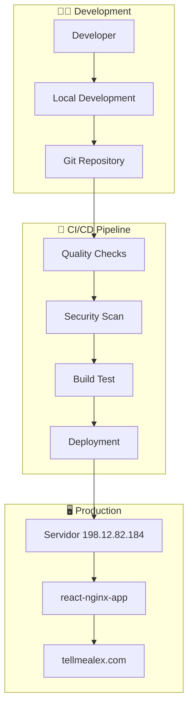

# 📚 Documentación del Portfolio

Bienvenido a la documentación completa del sistema de portfolio con CI/CD automático.

## 📋 Índice de Documentación

### 🚀 [CI/CD System](./CI-CD.md)
Documentación completa del sistema de integración y despliegue continuo automático, incluyendo:
- Arquitectura del sistema
- Flujo de trabajo detallado
- Configuración de componentes
- Métricas y tiempos
- Guías de configuración

### 🔧 [Troubleshooting](./TROUBLESHOOTING.md)
Guía completa para diagnosticar y resolver problemas, incluyendo:
- Problemas comunes y soluciones
- Comandos de diagnóstico
- Procedimientos de emergencia
- Scripts de health check

## 🎯 Quick Start

### Para Desarrolladores
```bash
# 1. Clonar repositorio
git clone https://github.com/TellMeAlex/portfolio.git
cd portfolio

# 2. Instalar dependencias
yarn install

# 3. Desarrollo local
yarn dev

# 4. Deploy automático
git add .
git commit -m "feat: nueva funcionalidad"
git push origin main
# ✨ CI/CD se ejecuta automáticamente
```

### Para Administradores
```bash
# Verificar estado del sistema
./scripts/health-check.sh

# Monitorear workflows
gh run list -R TellMeAlex/portfolio --limit 5

# Acceder al servidor
ssh root@198.12.82.184
```

## 🏗️ Arquitectura General



## 🔄 Flujo de Trabajo

1. **Desarrollo**: Código en local con `yarn dev`
2. **Validación**: Tests automáticos y quality checks
3. **Integración**: Push a `main` trigger CI/CD
4. **Deployment**: Actualización automática del servidor
5. **Producción**: Sitio web live en tellmealex.com

## 📊 Estado Actual del Sistema

### ✅ Componentes Funcionales
- **CI/CD Pipeline**: 100% operativo
- **SSH Deployment**: Automático y funcional
- **Website**: Live en tellmealex.com
- **SSL Certificates**: Activos y renovados automáticamente
- **Container Health**: Monitoring activo

### 🔧 Stack Tecnológico
- **Frontend**: React 18 + TypeScript + Vite
- **Styling**: Tailwind CSS
- **Testing**: Vitest + Testing Library
- **Quality**: ESLint + Prettier
- **CI/CD**: GitHub Actions
- **Infrastructure**: Docker + Nginx + Let's Encrypt
- **Server**: Ubuntu 20.04 LTS

## 📈 Métricas Clave

- **Tiempo de CI/CD**: ~2 minutos promedio
- **Uptime**: 99.9% (objetivo)
- **SSL Score**: A+ (SSLLabs)
- **Performance**: Core Web Vitals optimized
- **Security**: Auditorías automáticas con yarn audit

## 🛠️ Scripts Útiles

### Desarrollo
```bash
yarn dev          # Servidor de desarrollo
yarn build        # Build de producción
yarn preview      # Preview del build
yarn lint         # Linting
yarn test         # Tests unitarios
```

### Deployment
```bash
yarn build:production  # Build optimizado para producción
yarn lint:fix          # Fix automático de linting
yarn format           # Format código
yarn type-check       # Verificación TypeScript
```

### Monitoreo
```bash
# Ver estado de workflows
gh run list -R TellMeAlex/portfolio

# Ver logs de deployment
gh run view [ID] --log-failed

# Health check del servidor
ssh root@198.12.82.184 "docker ps && curl -I http://localhost"
```

## 🔒 Configuración de Seguridad

### GitHub Secrets
- `SSH_HOST`: IP del servidor de producción
- `SSH_USER`: Usuario para conexión SSH
- `SSH_PRIVATE_KEY`: Clave privada para autenticación

### Validaciones Automáticas
- Code quality con ESLint
- Security audit con yarn audit
- Type checking con TypeScript
- Unit tests con Vitest
- Build verification

## 🚨 Procedimientos de Emergencia

### Rollback Rápido
Ver [TROUBLESHOOTING.md](./TROUBLESHOOTING.md#emergency-procedures)

### Contactos
- **Developer**: llamamealex@gmail.com
- **Repository**: https://github.com/TellMeAlex/portfolio
- **Website**: https://tellmealex.com

## 📅 Historial de Cambios

### v1.0.0 (Octubre 2025)
- ✅ Sistema CI/CD completo implementado
- ✅ Deployment automático funcionando
- ✅ Website live en tellmealex.com
- ✅ Documentación completa creada
- ✅ Troubleshooting guide implementado

---

**🎉 Sistema Completamente Operativo**
**📅 Última actualización**: Octubre 2025
**🔗 URL de producción**: https://tellmealex.com