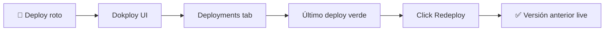

# 🔧 Guía de Troubleshooting CI/CD

Esta guía cubre el diagnóstico del pipeline actual: GitHub Actions (quality gates) + Dokploy (build y deploy del contenedor) + Traefik (TLS). Para la arquitectura completa, ver [CI-CD.md](./CI-CD.md).

## 🚨 Problemas Comunes y Soluciones

### 1. CI/CD Pipeline Fallando

#### ❌ Quality Checks Fallando

**Síntomas:**

- ESLint errors
- Format check failures
- TypeScript errors
- Test failures

**Diagnóstico:**

```bash
# Reproduce los gates localmente
npm run lint
npm run format:check
npm run type-check
npm run test:unit
```

**Soluciones:**

```bash
# Fix linting
npm run lint -- --fix

# Fix formatting
npm run format

# Debug tests
npm run test:unit -- --reporter=verbose
```

#### ❌ Security Scan con Vulnerabilidades

`security-scan` corre `npm audit --audit-level moderate` con `continue-on-error: true`: informa pero **no** bloquea el build. Aun así, conviene resolver hallazgos.

```bash
npm audit
npm audit --audit-level=moderate
npm audit fix
npm update <package-name>
```

#### ❌ Build Test Fallando

**Síntomas:**

- `npm run build` falla en CI o en Dokploy
- Import/export errors
- Errores de Vite/Rollup

**Diagnóstico:**

```bash
npm run build
npm run type-check
```

**Soluciones:**

```bash
# Limpieza completa
rm -rf dist/ node_modules/
npm install
npm run build

# Probar la build idéntica a producción (multi-stage Docker)
docker build -t portfolio:test .
docker run --rm -p 8080:80 portfolio:test
curl -I http://localhost:8080
```

> Si el build pasa en local pero falla en Dokploy, casi siempre es un problema de variables de entorno o de versión de Node. El [Dockerfile](../Dockerfile) usa `node:25-slim`; aliñar `nvm use 20+` en local si difiere.

---

### 2. Dokploy / Webhook Deployment

#### ❌ Push a main pero Dokploy no construye

**Síntomas:** GitHub Actions termina OK pero no aparece un nuevo deployment en la UI de Dokploy, y la web sigue sirviendo la versión anterior.

**Diagnóstico:**

```bash
# 1. ¿Existe el webhook configurado en GitHub?
gh api repos/TellMeAlex/portfolio/hooks --jq '.[] | {url: .config.url, active: .active, events: .events}'

# 2. ¿Está la GitHub App de Dokploy instalada y con acceso al repo?
gh api /repos/TellMeAlex/portfolio/installation 2>/dev/null | jq '.app_slug, .permissions'

# 3. Recent deliveries del webhook (200 OK = bien, 5xx/timeout = mal)
#    GitHub UI: Settings → Webhooks → [webhook] → Recent Deliveries
```

**Causas frecuentes:**

| Causa                              | Cómo se ve                             | Solución                                                                                                    |
| ---------------------------------- | -------------------------------------- | ----------------------------------------------------------------------------------------------------------- |
| GitHub App revocada o sin permisos | "Recent Deliveries" vacío o 403        | Reinstalar `Dokploy-2025-10-23-b1h5vv` con acceso al repo                                                   |
| Dokploy no alcanzable desde GitHub | Recent Deliveries con timeout / 5xx    | Verificar reverse proxy (Traefik) que expone la API de Dokploy; ver [WEBHOOK-SETUP.md](../WEBHOOK-SETUP.md) |
| Auto-deploy desactivado en Dokploy | Webhook responde 200 pero no construye | UI de Dokploy → portfolio-app → Source → habilitar "Auto Deploy" en rama `main`                             |
| Rama distinta a `main`             | Push a `develop` no dispara nada       | Es el comportamiento esperado; el webhook solo escucha `main`                                               |

**Fix manual (forzar deploy ahora):**

1. Acceder a Dokploy: `http://100.122.202.103:3000` (vía Tailscale).
2. **Projects → portfolio → portfolio-app**.
3. Click **Deploy**. Dokploy clonará el último commit de `main` y construirá.

#### ❌ Deploy iniciado pero falla en build

**Síntomas:** Dokploy muestra el deploy en estado `failed` o `error` en la pestaña Deployments.

**Diagnóstico:**

```bash
# Logs de la build (desde el VPS o vía Tailscale)
ssh servidor-198 'docker service logs dokploy --tail 200 | grep -i portfolio'

# Inspeccionar el log del deploy concreto desde la UI:
#   portfolio-app → Deployments → [click en el fallido] → View Logs
```

**Causas frecuentes:**

- **Dependencias rotas**: `npm ci` falla porque `package-lock.json` y `package.json` no concuerdan. Reproducir local con `rm -rf node_modules && npm ci`.
- **Type errors**: el Dockerfile corre `npm run type-check` en el builder; si falla allí, falla todo. Correr local primero.
- **OOM en la Raspberry Pi**: si Dokploy se queda sin memoria durante el build de Vite, mover la build al VPS (cambiar el "Build Server" en la config de la app en Dokploy).

#### ❌ Build pasa pero contenedor no arranca (healthcheck failing)

**Síntomas:** Dokploy completa el build pero el deploy queda en `unhealthy` o reinicia en bucle.

**Diagnóstico:**

```bash
# Estado del service y sus tasks
ssh servidor-198 'docker service ps portfolio-portfolioapp-cjgywg --no-trunc'

# Logs del contenedor
ssh servidor-198 'docker service logs portfolio-portfolioapp-cjgywg --tail 100'

# Health del contenedor
ssh servidor-198 'docker inspect $(docker ps -q --filter "name=portfolio-portfolioapp") --format "{{json .State.Health}}" | jq'
```

**Solución:**

- Si `nginx` reporta errores de configuración, revisar [nginx.conf](../nginx.conf). El healthcheck es `curl -f http://localhost/`: si la raíz no devuelve 200, el contenedor se marca unhealthy.
- Rollback inmediato desde Dokploy: **Deployments → [deploy anterior] → Redeploy**.

---

### 3. Website Issues

#### ❌ Sitio web sirve versión antigua tras un deploy aparentemente exitoso

**Síntomas:** Dokploy reporta deploy `success`, pero `https://tellmealex.dev` muestra contenido anterior.

**Diagnóstico:**

```bash
# ¿Qué task está sirviendo realmente?
ssh servidor-198 'docker service ps portfolio-portfolioapp-cjgywg --no-trunc | head -5'

# Headers de respuesta (last-modified, etag)
curl -I https://tellmealex.dev

# Contenido del index.html servido
curl -s https://tellmealex.dev | grep -E '<title>|<meta name="version"' | head -5
```

**Causas frecuentes:**

1. **Caché del navegador**: hard refresh con Ctrl+Shift+R, o probar en incógnito.
2. **Caché de Traefik / CDN**: comprobar el header `cf-cache-status` (si hay Cloudflare por delante) o reiniciar el servicio de Traefik:
   ```bash
   ssh servidor-198 'docker service update --force dokploy-traefik'
   ```
3. **Rolling update incompleto**: una task vieja sigue sirviendo. Force redeploy:
   ```bash
   ssh servidor-198 'docker service update --force portfolio-portfolioapp-cjgywg'
   ```

#### ❌ SSL / HTTPS Issues

**Síntomas:** Warning de certificado, HTTPS no redirige, mixed content.

**Diagnóstico:**

```bash
# Validar la cadena del certificado desde fuera
curl -vI https://tellmealex.dev 2>&1 | grep -E 'subject:|issuer:|expire'

# Logs de Traefik (gestor de Let's Encrypt en Dokploy)
ssh servidor-198 'docker service logs dokploy-traefik --tail 100 | grep -iE "acme|cert|tellmealex"'
```

**Soluciones:**

El TLS lo gestiona **Traefik dentro de Dokploy**, no certbot ni `/etc/letsencrypt`. Para renovar o regenerar:

1. **UI de Dokploy → portfolio-app → Domains**.
2. Verificar que el dominio `tellmealex.dev` está listado con certResolver `letsencrypt`.
3. Si el cert no se ha emitido (Traefik error en logs):
   - Confirmar que el DNS `A` de `tellmealex.dev` apunta al VPS (`198.12.82.184`).
   - Confirmar que el puerto 80 está abierto en el firewall del VPS (Let's Encrypt HTTP-01 challenge).
   - En la UI de Dokploy: **Redeploy** la app para forzar un nuevo challenge.
4. Si quieres forzar el flujo manualmente:
   ```bash
   # Reiniciar Traefik fuerza el reintento del ACME challenge
   ssh servidor-198 'docker service update --force dokploy-traefik'
   ```

---

## 🔍 Comandos de Diagnóstico

### GitHub Actions

```bash
gh run list -R TellMeAlex/portfolio --limit 10
gh run view <RUN_ID> -R TellMeAlex/portfolio
gh run view <RUN_ID> --log-failed -R TellMeAlex/portfolio
gh run rerun <RUN_ID> -R TellMeAlex/portfolio
```

### Dokploy (API + UI)

```bash
# Listar deployments de la app vía API (requiere DOKPLOY_API_TOKEN)
curl -H "x-api-key: $DOKPLOY_API_TOKEN" \
  http://100.122.202.103:3000/api/application/portfolio-app/deployments | jq

# Logs del servicio Dokploy en el VPS
ssh servidor-198 'docker service logs dokploy --tail 200 | grep -i portfolio'
```

### Contenedor en producción

```bash
# Lista de services de la stack portfolio
ssh servidor-198 'docker service ls | grep portfolio'

# Detalle de las tasks (instancias) del service
ssh servidor-198 'docker service ps portfolio-portfolioapp-cjgywg --no-trunc'

# Logs en tiempo real
ssh servidor-198 'docker service logs -f portfolio-portfolioapp-cjgywg --tail 100'

# Inspeccionar configuración del service (imagen, networks, labels Traefik)
ssh servidor-198 'docker service inspect portfolio-portfolioapp-cjgywg --pretty'

# Verificar el sitio desde el propio VPS (sin pasar por DNS público)
ssh servidor-198 'curl -I http://localhost'
```

### Desarrollo local

```bash
npm install
npm run lint
npm run type-check
npm run test:unit
npm run build
npm run preview

# Build idéntica a producción
docker build -t portfolio:local .
docker run --rm -p 8080:80 portfolio:local
```

---

## 🚨 Procedimientos de Emergencia

### 1. Rollback Rápido



Pasos:

1. Acceder a Dokploy (`http://100.122.202.103:3000`).
2. **Projects → portfolio → portfolio-app → Deployments**.
3. Localizar el último deploy `success` previo al fallo.
4. Click **Redeploy** sobre él.
5. Verificar con `curl -I https://tellmealex.dev`.

### 2. Force Update del Contenedor

Si el contenedor está vivo pero sirve mal (e.g. healthcheck flake-y):

```bash
ssh servidor-198 'docker service update --force portfolio-portfolioapp-cjgywg'
```

Esto fuerza una rolling update con la misma imagen. Útil cuando un contenedor queda en un estado degradado pero la imagen es correcta.

### 3. Deploy Manual desde la UI

Si el webhook está caído y necesitas desplegar ya:

1. Dokploy UI → portfolio-app → **Deploy**.
2. Dokploy clona el último commit de la rama configurada (`main`) y construye.
3. No requiere acción en GitHub.

### 4. Bypass Total (sin Dokploy)

> ⚠️ **Solo emergencias**. Saltarse Dokploy significa que la próxima vez que Dokploy haga deploy revertirá tus cambios.

```bash
# Construir la imagen localmente y subirla al VPS
docker build -t portfolio:emergency .
docker save portfolio:emergency | ssh servidor-198 'docker load'

# Actualizar el service para usar la imagen local
ssh servidor-198 'docker service update --image portfolio:emergency portfolio-portfolioapp-cjgywg'
```

Recuerda: en cuanto soluciones el problema real, dispara un deploy normal por Dokploy para restablecer el estado canónico.

---

## 📊 Health Check Script

Guarda este script como `scripts/health-check.sh`:

```bash
#!/bin/bash
set -u

echo "🔍 Sistema CI/CD Health Check"
echo "=============================="

# 1. GitHub Actions
echo -e "\n📊 GitHub Actions (últimos 3 runs):"
gh run list -R TellMeAlex/portfolio --limit 3

# 2. Webhook de GitHub
echo -e "\n🪝 Webhooks configurados en el repo:"
gh api repos/TellMeAlex/portfolio/hooks \
  --jq '.[] | "\(.config.url) (active=\(.active))"'

# 3. Service en Docker Swarm
echo -e "\n🐝 Estado del Docker service:"
ssh -o ConnectTimeout=10 servidor-198 \
  'docker service ls --filter name=portfolio --format "table {{.Name}}\t{{.Replicas}}\t{{.Image}}"'

# 4. Tasks (instancias)
echo -e "\n📦 Tasks activas:"
ssh servidor-198 \
  'docker service ps portfolio-portfolioapp-cjgywg --filter desired-state=running --no-trunc | head -3'

# 5. Sitio web
echo -e "\n🌐 Sitio web:"
HTTP_STATUS=$(curl -s -o /dev/null -w "%{http_code}" https://tellmealex.dev || echo "000")
if [ "$HTTP_STATUS" = "200" ] || [ "$HTTP_STATUS" = "301" ]; then
    echo "✅ tellmealex.dev: OK (HTTP $HTTP_STATUS)"
else
    echo "❌ tellmealex.dev: FAILED (HTTP $HTTP_STATUS)"
fi

# 6. Certificado SSL
echo -e "\n🔒 Certificado SSL:"
echo | openssl s_client -servername tellmealex.dev -connect tellmealex.dev:443 2>/dev/null \
  | openssl x509 -noout -dates -issuer

echo -e "\n✅ Health check complete!"
```

---

## 📞 Escalación

Si tras seguir esta guía el problema persiste:

1. **Capturar logs**:
   - GitHub Actions: `gh run view <RUN_ID> --log-failed > ci-failure.log`
   - Dokploy: `ssh servidor-198 'docker service logs dokploy --tail 500' > dokploy.log`
   - Contenedor: `ssh servidor-198 'docker service logs portfolio-portfolioapp-cjgywg --tail 500' > app.log`
2. **Confirmar estado externo**: DNS de `tellmealex.dev`, accesibilidad del VPS, certificado actual.
3. **Reproducir local** con `docker build` + `docker run` para descartar problemas de código vs problemas de infra.
4. Documentar pasos seguidos antes de pedir ayuda — tres cuartas partes del troubleshooting es saber exactamente qué se intentó.

---

**📅 Última actualización**: 2026-05-23
**🔗 Documentación CI/CD**: [CI-CD.md](./CI-CD.md)
**🔗 Setup de Dokploy**: [DOKPLOY-AUTO-DEPLOY-SETUP.md](../DOKPLOY-AUTO-DEPLOY-SETUP.md) · [WEBHOOK-SETUP.md](../WEBHOOK-SETUP.md)
**📧 Contacto**: llamamealex@gmail.com
