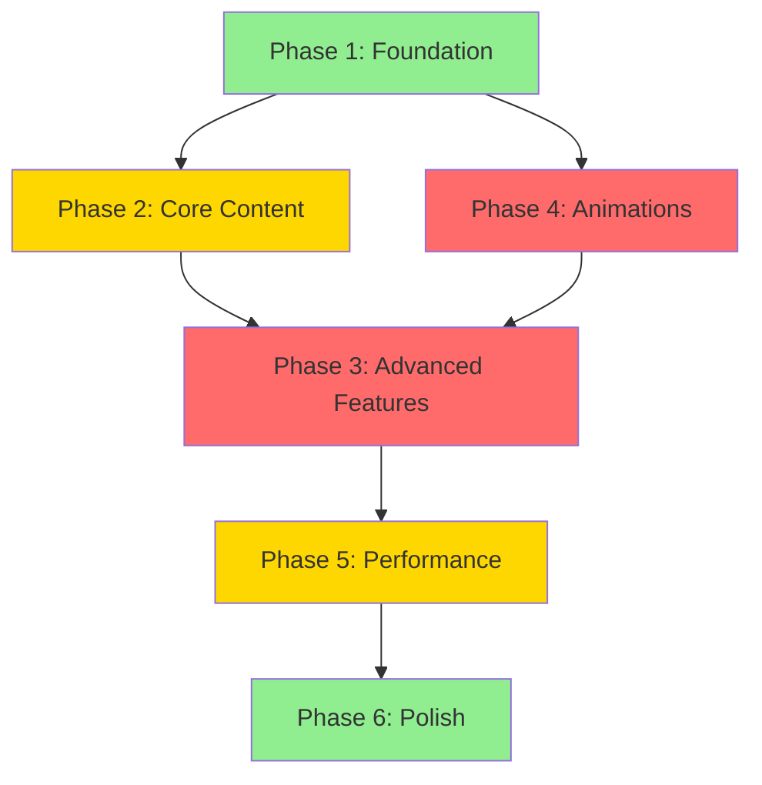

# Project Overview - Portfolio Alejandro de la Fuente

**Versión**: 2.0 (Reestructurado)
**Última actualización**: 20 Enero 2025
**Total Timeline**: 10-15 semanas
**Estado**: En Desarrollo Activo

---

## 🎯 Vista Rápida del Proyecto

### Objetivo Principal
Crear un portfolio profesional moderno que demuestre excelencia técnica a través de:
- **Diseño**: Bento Grid responsive con animaciones sofisticadas
- **Rendimiento**: Lighthouse >90 en todas las categorías
- **Accesibilidad**: WCAG 2.1 AA compliance (Lighthouse 100)
- **Tecnología**: HTML5/CSS3/JavaScript + Progressive Enhancement

### Público Objetivo
- Reclutadores técnicos en empresas tech
- Technical Leaders y Engineering Managers
- Potenciales clientes para proyectos freelance
- Comunidad tech (networking profesional)

---

## 📊 Arquitectura de Información

```
Portfolio Website
│
├── 🎨 HERO SECTION (XL 3x2)
│   ├── Profile Image + Professional Title
│   ├── Typing Effect: "Technical Leader Specialist | Experto en IA"
│   ├── Location: Jaén, Andalucía, España
│   └── CTAs: Ver Proyectos | Descargar CV | Contactar
│
├── 👤 ABOUT ME (Large 2x2)
│   ├── Professional Background (3+ años NTT DATA)
│   ├── Current Role: Technical Leader Specialist
│   ├── Specialization: AI, ReactJS, Microfrontends
│   └── Availability Badge
│
├── 🤖 AI LEADERSHIP (Large 2x2)
│   ├── Current Responsibilities at NTT DATA
│   ├── Workshops: GenAI, Copilot Agents, Dev Containers
│   ├── Technical Selection Processes
│   └── Certifications: GenAI Yellow Belt P1
│
├── 💼 EXPERIENCE TIMELINE (XL 3x2)
│   ├── NTT DATA (2022 - Presente)
│   │   ├── Technical Leader Specialist (Jul 2025 - Presente)
│   │   ├── Technical Senior Specialist (Ene 2025 - Jul 2025)
│   │   ├── Desarrollador Sénior (Mayo 2023 - Ene 2025)
│   │   ├── Desarrollador Sénior (Feb 2023 - Mayo 2023)
│   │   └── Desarrollador Web (Jun 2022 - Feb 2023)
│   │
│   └── HelloAuto (Feb 2021 - Jun 2022)
│       └── Desarrollador Full Stack
│
├── 🚀 PROJECTS SHOWCASE (XL 3x3)
│   ├── Inditex Store Management Platform
│   │   ├── Microfrontends Architecture
│   │   ├── 100% tiendas España + 5 países
│   │   └── Tech: React, RTK Query, Azure
│   │
│   ├── RTVE Play CMS
│   │   ├── National Broadcasting APIs
│   │   ├── 70% reducción errores
│   │   └── Tech: Node.js, Puppeteer, Swig.js
│   │
│   └── HelloAuto Telemetry Dashboard
│       ├── IoT Fleet Monitoring
│       ├── 1M+ eventos/día, 500+ vehículos
│       └── Tech: React, Node.js, Express, Azure
│
├── 🛠️ TECHNICAL SKILLS (Large 2x2)
│   ├── Frontend Mastery: React, Redux Toolkit, Microfrontends
│   ├── IA & Automatización: GenAI, Copilot, LangChain
│   ├── Backend & Cloud: Node.js, Express, Azure
│   └── Arquitectura: Microfrontends, Design Systems
│
├── 📊 STATISTICS DASHBOARD (Medium 2x1)
│   ├── 3+ años experiencia
│   ├── 5 proyectos alto impacto
│   ├── 3 devs mentoreados
│   ├── 100% tiendas Inditex España
│   └── ∞ talleres impartidos
│
├── 🎓 CERTIFICATIONS & EDUCATION (Medium 2x1)
│   ├── GenAI Academy: Yellow Belt P1 (2025)
│   ├── GenAI Academy: White Belt (2025)
│   ├── React JS Avanzado
│   ├── Node.js & Express
│   └── CFGS Desarrollo de Aplicaciones Web (2017-2019)
│
├── 💡 VALUES & PHILOSOPHY (Large 2x2)
│   ├── Personal Quote
│   └── Core Values:
│       ├── Innovación continua
│       ├── Colaboración y mentoría
│       ├── Aprendizaje permanente
│       ├── Calidad y buenas prácticas
│       └── Visión de producto
│
└── 📧 CONTACT & SOCIAL (Medium 2x1)
    ├── Email: llamamealex@gmail.com
    ├── LinkedIn: linkedin.com/in/alejandro-de-la-fuente
    ├── GitHub: github.com/TellMeAlex
    ├── Phone: +34 629 20 26 39
    └── WhatsApp Integration
```

---

## 🗺️ Navegación de Documentación

### Documentos Centralizados (Consulta Frecuente)

| Documento | Propósito | Cuándo Usar |
|-----------|-----------|-------------|
| **[00-PROJECT-OVERVIEW.md](00-PROJECT-OVERVIEW.md)** | Este documento - Vista general | Inicio del proyecto, orientación |
| **[01-TECHNICAL-REFERENCE.md](01-TECHNICAL-REFERENCE.md)** | Design system, grid, animaciones | Durante implementación técnica |
| **[02-CONTENT-SPECIFICATIONS.md](02-CONTENT-SPECIFICATIONS.md)** | Contenido estructurado (JSON) | Actualizar información personal |
| **[03-COMPONENT-LIBRARY.md](03-COMPONENT-LIBRARY.md)** | Catálogo de componentes | Implementar/reutilizar componentes |

### PRDs por Fase

| Fase | Documento | Timeline | Complejidad | Descripción |
|------|-----------|----------|-------------|-------------|
| **1** | [phases/PHASE-01-Foundation.md](phases/PHASE-01-Foundation.md) | 2-3 sem | 🟢 Medium | Design system + Bento Grid |
| **2** | [phases/PHASE-02-Core-Content.md](phases/PHASE-02-Core-Content.md) | 2-3 sem | 🟡 Medium-High | Hero, About, Contact |
| **3** | [phases/PHASE-03-Advanced-Features.md](phases/PHASE-03-Advanced-Features.md) | 3-4 sem | 🔴 High | Timeline, Projects, Skills |
| **4** | [phases/PHASE-04-Animations.md](phases/PHASE-04-Animations.md) | 2-3 sem | 🔴 High | Scroll animations, micro-interactions |
| **5** | [phases/PHASE-05-Performance.md](phases/PHASE-05-Performance.md) | 1-2 sem | 🟡 Medium | Optimization + SEO |
| **6** | [phases/PHASE-06-Polish.md](phases/PHASE-06-Polish.md) | 1-2 sem | 🟢 Medium | Accessibility + Premium touches |

### Quick References (Consulta Rápida)

| Documento | Uso | Formato |
|-----------|-----|---------|
| [quick-references/design-tokens.md](quick-references/design-tokens.md) | Copy-paste CSS variables | CSS Ready |
| [quick-references/accessibility-checklist.md](quick-references/accessibility-checklist.md) | Validación WCAG AA | Checklist |
| [quick-references/performance-budgets.md](quick-references/performance-budgets.md) | Core Web Vitals targets | Metrics Table |
| [quick-references/browser-compatibility.md](quick-references/browser-compatibility.md) | Browser support matrix | Compatibility Grid |

### Templates Reutilizables

| Template | Uso |
|----------|-----|
| [templates/component-template.md](templates/component-template.md) | Documentar nuevos componentes |
| [templates/feature-template.md](templates/feature-template.md) | Especificar nuevas features |
| [templates/testing-checklist.md](templates/testing-checklist.md) | Testing de features/componentes |

---

## 🏗️ Stack Tecnológico

### Core Technologies
```yaml
HTML: HTML5 (Semantic markup)
CSS:
  - CSS3 Grid/Flexbox
  - CSS Custom Properties (Design Tokens)
  - CSS Animations + Transitions
JavaScript:
  - ES6+ (Vanilla JavaScript)
  - Intersection Observer API
  - Web Animations API
  - Optional: React (Phase enhancement)

Fonts:
  - Inter Variable (Body text)
  - JetBrains Mono Variable (Code)

Images:
  - AVIF (Primary, 50% quality)
  - WebP (Fallback, 75% quality)
  - JPEG (Final fallback, 85% quality)
```

### Development Tools
```yaml
Build Tools: Vite / Webpack (TBD)
CSS: PostCSS + Autoprefixer
JS: Babel (ES6+ transpilation)
Testing:
  - Lighthouse CI
  - axe-core (Accessibility)
  - WAVE (Accessibility)
Optimization:
  - Sharp (Image processing)
  - Terser (JS minification)
  - cssnano (CSS minification)
```

### Deployment & Hosting
```yaml
Hosting: TBD (Vercel / Netlify / GitHub Pages)
Domain: alejandrodelafuente.dev (Proposed)
CI/CD: GitHub Actions
SSL: Automatic (Let's Encrypt)
CDN: Cloudflare (Optional)
```

---

## 📈 Matriz de Dependencias entre Fases



### Dependencias Detalladas

**Phase 1 (Foundation)** - Sin dependencias
- Outputs: Design system, Grid system, Theme toggle
- Bloqueante para: Todas las demás fases

**Phase 2 (Core Content)** - Requiere: Phase 1
- Outputs: Hero, About, Contact sections
- Bloqueante para: Phase 3

**Phase 3 (Advanced Features)** - Requiere: Phase 2
- Outputs: Timeline, Projects, Skills
- Bloqueante para: Phase 5

**Phase 4 (Animations)** - Requiere: Phase 1
- Outputs: Animation system, scroll effects
- Puede ejecutarse en paralelo con Phase 2-3
- Bloqueante para: Phase 5 (optimización de animaciones)

**Phase 5 (Performance)** - Requiere: Phase 3, 4
- Outputs: Optimized assets, SEO, Analytics
- Bloqueante para: Phase 6

**Phase 6 (Polish)** - Requiere: Phase 5
- Outputs: Accessibility AA, Premium features
- No bloqueante (fase final)

---

## 🎨 Design System - Resumen Visual

### Color Palette
```
🌑 Navy      #0A192F  ━━━━━━━  Primary Background
🔵 Cyan      #64FFDA  ━━━━━━━  Accent Color
⚪ White     #FFFFFF  ━━━━━━━  Primary Text
🔘 Gray      #8892B0  ━━━━━━━  Secondary Text
⚫ Slate     #2E3A52  ━━━━━━━  Card Backgrounds
```

### Typography Scale
```
H1  48px (3rem)    ━━━━━  Page Titles
H2  36px (2.25rem) ━━━━━  Section Headings
H3  24px (1.5rem)  ━━━━━  Card Titles
H4  20px (1.25rem) ━━━━━  Subsections
P   16px (1rem)    ━━━━━  Body Text
SM  14px (0.875rem)━━━━━  Captions
```

### Spacing System (8px base)
```
4px   ┆  Fine adjustments
8px   ┇  Tight spacing
16px  ┃  Default spacing
24px  ┃  Card padding
32px  ┃  Section gaps
48px  ┃  Large gaps
64px+ ┃  Hero sections
```

### Grid Breakpoints
```
320px+   [■]          1 column  (Mobile)
768px+   [■][■]       2 columns (Tablet)
1024px+  [■][■][■]    3 columns (Small Desktop)
1280px+  [■][■][■][■] 4 columns (Desktop)
```

---

## 🎯 Objetivos de Calidad

### Performance Targets

| Metric | Target | Status |
|--------|--------|--------|
| **Lighthouse Performance** | ≥90 | 🎯 To achieve |
| **Lighthouse Accessibility** | 100 | 🎯 To achieve |
| **Lighthouse Best Practices** | ≥90 | 🎯 To achieve |
| **Lighthouse SEO** | ≥90 | 🎯 To achieve |
| **First Contentful Paint** | <1.5s | 🎯 To achieve |
| **Largest Contentful Paint** | <2.5s | 🎯 To achieve |
| **Cumulative Layout Shift** | <0.1 | 🎯 To achieve |
| **First Input Delay** | <100ms | 🎯 To achieve |

### Accessibility Standards

- ✅ **WCAG 2.1 Level AA** compliance
- ✅ **Screen reader** optimized (NVDA, JAWS, VoiceOver)
- ✅ **Keyboard navigation** for all functionality
- ✅ **Color contrast** ratios ≥4.5:1 (normal text)
- ✅ **Focus indicators** visible on all interactive elements
- ✅ **Semantic HTML** with proper landmarks
- ✅ **ARIA labels** where needed (not over-used)

### Browser Support

| Browser | Minimum Version | Support Level |
|---------|----------------|---------------|
| Chrome | Last 2 versions | ✅ Full |
| Firefox | Last 2 versions | ✅ Full |
| Safari | Last 2 versions | ✅ Full |
| Edge | Last 2 versions | ✅ Full |
| Mobile Safari | iOS 13+ | ✅ Full |
| Chrome Mobile | Android 8+ | ✅ Full |

### SEO Requirements

- ✅ Structured data (JSON-LD) for Person, WebSite, WebPage
- ✅ Open Graph tags for social media
- ✅ Twitter Card metadata
- ✅ Canonical URLs
- ✅ Sitemap.xml
- ✅ Robots.txt
- ✅ Meta descriptions optimized
- ✅ Semantic HTML structure

---

## 📚 Glosario Técnico

### Términos de Arquitectura

**Bento Grid**
: Sistema de layout tipo dashboard donde los cards tienen diferentes tamaños (1x1, 2x1, 2x2, 3x2) y se organizan en una cuadrícula responsive.

**Design Tokens**
: Variables CSS que contienen valores de diseño (colores, espaciado, tipografía) para mantener consistencia.

**Microfrontends**
: Arquitectura donde la aplicación frontend se divide en features independientes que pueden desarrollarse y desplegarse de forma autónoma.

### Términos de Rendimiento

**Core Web Vitals**
: Métricas de Google para medir experiencia de usuario: LCP (carga), FID (interactividad), CLS (estabilidad visual).

**Critical CSS**
: CSS mínimo necesario para renderizar el contenido above-the-fold, inlineado en el HTML para acelerar la primera renderización.

**Lazy Loading**
: Técnica de cargar recursos (imágenes, componentes) solo cuando están a punto de ser visibles en viewport.

### Términos de Accesibilidad

**WCAG 2.1 AA**
: Web Content Accessibility Guidelines nivel AA - estándar internacional de accesibilidad web.

**ARIA (Accessible Rich Internet Applications)**
: Conjunto de atributos HTML para mejorar accesibilidad de componentes dinámicos para screen readers.

**Skip Links**
: Enlaces invisibles al inicio de la página que permiten a usuarios de teclado/screen reader saltar al contenido principal.

---

## 🚀 Roadmap de Implementación

### Milestone 1: MVP Funcional (Semanas 1-6)
- ✅ Phase 1: Foundation & Design System
- ✅ Phase 2: Core Content Implementation
- 🎯 **Resultado**: Portfolio funcional con contenido básico

### Milestone 2: Features Avanzadas (Semanas 7-10)
- ⏳ Phase 3: Advanced Features (Timeline, Projects, Skills)
- ⏳ Phase 4: Animations & Micro-interactions
- 🎯 **Resultado**: Portfolio interactivo con todas las secciones

### Milestone 3: Production Ready (Semanas 11-13)
- ⏳ Phase 5: Performance Optimization & SEO
- ⏳ Phase 6: Final Polish & Accessibility
- 🎯 **Resultado**: Portfolio optimizado y accesible

### Milestone 4: Launch (Semana 14-15)
- 🚀 Deployment a producción
- 📊 Analytics setup y monitoring
- 📢 Anuncio profesional (LinkedIn, etc.)

---

## 📞 Información de Contacto (Canonical)

**Nombre Completo**: Alejandro de la Fuente de la Rosa
**Nombre Profesional**: Alejandro de la Fuente
**Título**: Technical Leader Specialist
**Empresa**: NTT DATA
**Ubicación**: Jaén, Andalucía, España

**Contacto**:
- 📧 Email: llamamealex@gmail.com
- 💼 LinkedIn: linkedin.com/in/alejandro-de-la-fuente
- 💻 GitHub: github.com/TellMeAlex
- 📱 Teléfono: +34 629 20 26 39

**Disponibilidad**: Abierto a nuevos retos y oportunidades

---

## 📝 Notas de Implementación

### Principios de Desarrollo

1. **Mobile First**: Diseñar primero para móvil, luego escalar a desktop
2. **Progressive Enhancement**: Funcionalidad básica sin JS, mejoras con JS
3. **Accessibility First**: Implementar accesibilidad desde el inicio, no al final
4. **Performance Budget**: Monitorear rendimiento en cada commit
5. **Semantic HTML**: Usar elementos HTML semánticos antes que divs genéricos

### Buenas Prácticas

- **DRY (Don't Repeat Yourself)**: Reutilizar componentes y estilos
- **BEM Methodology**: Nomenclatura CSS clara y escalable
- **Git Commits**: Mensajes descriptivos siguiendo conventional commits
- **Code Reviews**: Revisar código antes de merge a main
- **Testing**: Validar con Lighthouse y herramientas de accesibilidad

### Recursos Externos

- **Figma Designs**: [Link TBD]
- **Asset Repository**: [Link TBD]
- **API Endpoints**: N/A (portfolio estático)
- **Documentation**: Este directorio `/prds/`

---

## 🔄 Historial de Versiones

| Versión | Fecha | Cambios |
|---------|-------|---------|
| 2.0 | 2025-01-20 | Reestructuración completa de documentación |
| 1.0 | 2025-01-15 | Versión inicial de PRDs |

---

## ✅ Quick Start Guide

### Para Developers que se Unen al Proyecto

1. **Leer este documento** (00-PROJECT-OVERVIEW.md) - 10 min
2. **Revisar** [01-TECHNICAL-REFERENCE.md](01-TECHNICAL-REFERENCE.md) - Design system
3. **Explorar** [03-COMPONENT-LIBRARY.md](03-COMPONENT-LIBRARY.md) - Componentes disponibles
4. **Consultar** quick-references/ según necesidad
5. **Implementar** siguiendo el PRD de la fase actual

### Para Stakeholders

1. **Leer** este documento para contexto general
2. **Revisar** [02-CONTENT-SPECIFICATIONS.md](02-CONTENT-SPECIFICATIONS.md) para validar contenido
3. **Validar** diseños en Figma (cuando estén disponibles)
4. **Feedback** a través de GitHub Issues o reuniones de revisión

---

**Mantenido por**: Equipo de Desarrollo
**Última Actualización**: 20 Enero 2025
**Próxima Revisión**: Final de cada fase de desarrollo
**Contacto**: Crear issue en GitHub para dudas o sugerencias
